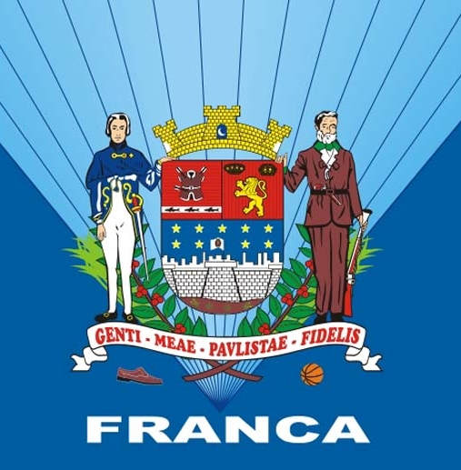

# Hackathon Uni-FACEF 2021
## Projeto desenvolvido em 1 semana

  <strong>Registro de Ocorrências na área ambiental e urbanística para a cidade de Franca</strong>
 
  Versão mobile do projeto desenvolvido pelo grupo CLPV durante o Hackathon 2021 da Uni-FACEF.

### Sobre o código (Mobile)
- Linguagem: ReactNative com Typescript;
- Padronização de código: ESLint e Prettier;
- Códigos em inglês.

### Algumas Screenshots do App

Clique [AQUI](__screenshots__/) para acessar as screenshots do aplicativo.
